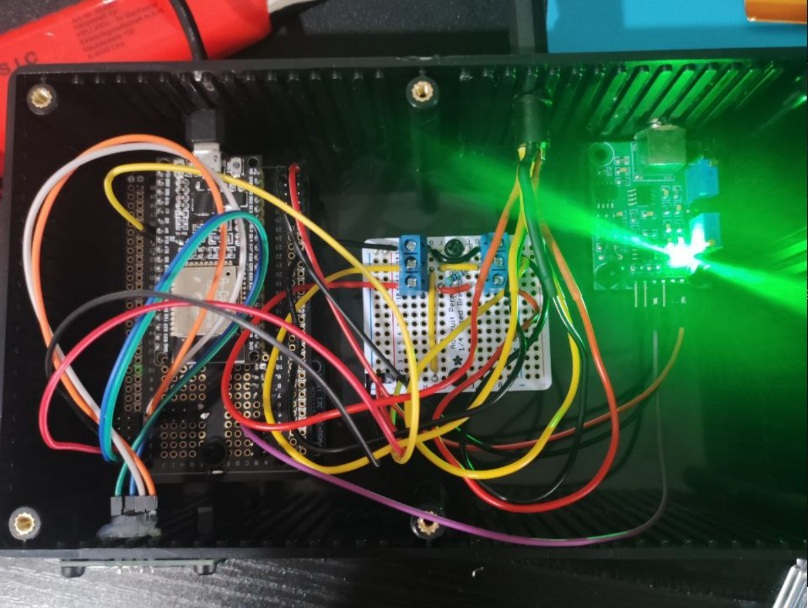
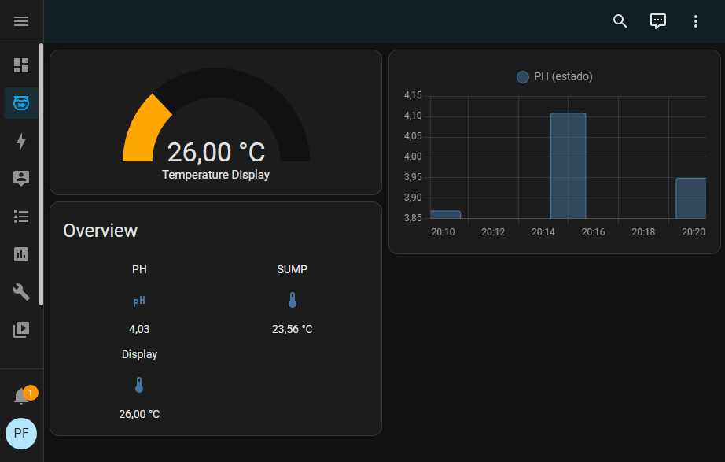

# Aquareo

**Aquareo** is an open source software and collection of tutorials that enables to you build your own aquarium controller with Arduino/ESP32/ESP8266 and several cheap electronic components.

### 🩺 Monitoring
Check your aquarium temperature, Ph and salinity in any MQTT-compatible home automation solution, like Home Assistant.

### 📟 Temperature Controller
Automatic turn on/off your header and fan/chiller to keep a stable temperature in your tank.

### 🪣 Auto Top-Off
Automatic evaporated water refill. Controls your salinity level to keep a healthy environment.

### 🧪 Dosing automation
Setups the dosing system to perform your dosing/balling.

And more ...

### 📦 Fully modular
Despite everything is meant to be built in a single box, you don't need to build all features at one. For instance: you can build only the monitoring component, add the dosing automation later, or use only the auto top-off system.

### 💸 Easy and inexpensive to build
Everything is built using some **Arduino compatible** boards and several electronic components. You can easly find everything on Amazon/Ebay/AliExpress. A basic electronic knowledge is required, but all tutorials will be easy to understand with simple diagrams.

## Roadmap

- [x] MQTT Integration
- [ ] Installation tutorials
- [ ] Auto update system
- [ ] Auto top-off
- [x] ds18b20 (temperature) integration
- [x] Ph sensor integration
- [ ] Salinity sensor integration
- [ ] Gembird powerstrip integration
- [ ] Temperature controller
- [ ] Dosing controller
- [ ] 3D-printed water test automation station

## Currently implemented drivers

| Module | Drivers |
| --- | --- |
| Board | ESP32 |
| Display | SSD1306 |
| Temperature | DS18B20 |
| PH | generic PH4502C |